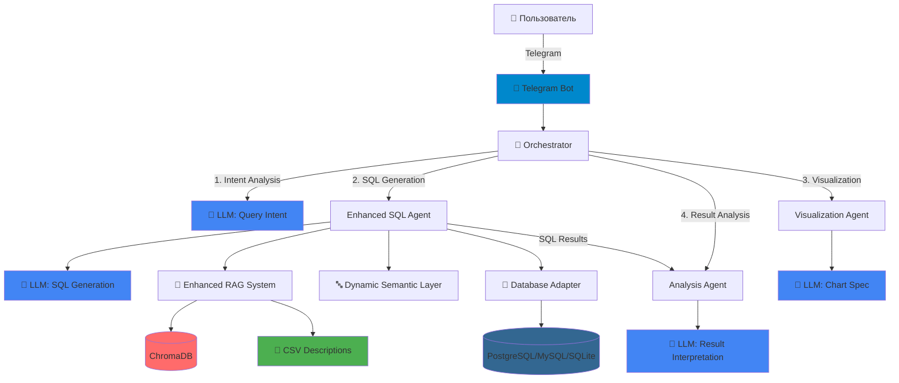

# Home Credit Analysis Bot - Мультиагентная система анализа кредитных рисков

<div align="center">


**Интеллектуальный телеграм-бот с AI агентами для анализа данных Home Credit Default Risk**

[Быстрый старт](#-быстрый-старт) • [Функции](#-основные-возможности) • [Архитектура](#-архитектура) • [Примеры](#-примеры-использования) • [API](#-api-документация)

</div>

---

## О проекте

**Home Credit Analysis Bot** - это продвинутая мультиагентная система, которая использует современные технологии искусственного интеллекта для анализа кредитных рисков. Бот позволяет анализировать данные на естественном языке через Telegram интерфейс.

### Решаемые задачи

- **Анализ кредитных рисков** - оценка вероятности дефолта заемщиков
- **SQL запросы на естественном языке** - преобразование вопросов в SQL
- **Интеллектуальная аналитика** - поиск паттернов и аномалий в данных
- **Визуализация данных** - автоматическое построение графиков и диаграмм
- **Рекомендации** - предложения по улучшению кредитной политики

## Быстрый старт

### Требования

- Python 3.10+
- Docker & Docker Compose
- 8GB+ RAM
- Telegram аккаунт
- Google аккаунт (для Gemini API)

### Установка за 5 минут

```bash
# 1. Клонирование репозитория
git clone https://github.com/yourusername/SQL_Agent_proj.git
cd SQL_Agent_proj

# 2. Настройка окружения
cp env.example .env
# Отредактируйте .env и добавьте:
# TELEGRAM_BOT_TOKEN=ваш_токен_от_@BotFather
# GEMINI_API_KEY=ваш_ключ_с_https://makersuite.google.com/app/apikey

# 3. Запуск базы данных
docker compose up -d

# 4. Установка зависимостей
pip install -r requirements.txt

# 5. Загрузка данных (опционально, если данные уже есть - пропустите)
python load_data_to_postgres.py

# 6. Запуск бота
python main.py
```

### Получение API ключей

<details>
<summary><b>Google Gemini API Key</b> (бесплатно)</summary>

1. Перейдите на [Google AI Studio](https://makersuite.google.com/app/apikey)
2. Нажмите "Create API Key"
3. Скопируйте ключ и вставьте в `.env`

</details>

<details>
<summary><b>Telegram Bot Token</b></summary>

1. Найдите [@BotFather](https://t.me/BotFather) в Telegram
2. Отправьте `/newbot`
3. Выберите имя и username для бота
4. Скопируйте токен и вставьте в `.env`

</details>

## Основные возможности

### Мультиагентная система

<table>
<tr>
<td width="50%">

#### Enhanced SQL Agent
- **Универсальная поддержка БД**: PostgreSQL, MySQL, SQLite
- **Schema-Guided Reasoning**: пошаговая генерация SQL
- **RAG с CSV описаниями**: использование официальных описаний колонок
- **Retry логика**: автоматическое исправление ошибок (до 3 попыток)
- **Post-processing**: автоматическое добавление LIMIT, CAST для агрегаций
- **Few-shot learning**: примеры из истории запросов

</td>
<td width="50%">

#### Analysis Agent  
- Статистический анализ данных
- Поиск паттернов и корреляций
- Детекция аномалий
- Генерация инсайтов на русском языке
- Анализ агрегированных результатов

</td>
</tr>
<tr>
<td width="50%">

#### Visualization Agent
- Автоматический выбор типа графика
- Интерактивные визуализации Plotly
- Экспорт в PNG (Kaleido) с fallback на JSON
- Адаптивный дизайн
- Поддержка: bar, line, pie, scatter, histogram

</td>
<td width="50%">

#### Orchestrator
- **Строгий pipeline**: Analysis → SQL → Visualization
- Асинхронная обработка запросов
- Координация работы агентов
- Управление контекстом
- Обработка ошибок и retry логика

</td>
</tr>
</table>

### 🧠 Enhanced RAG (Retrieval-Augmented Generation)

- **ChromaDB** для векторного поиска
- **Автоматическое индексирование** схемы БД при инициализации
- **Интеграция описаний колонок** из CSV файлов (HomeCredit_columns_description.csv)
- **Семантическое индексирование** таблиц, колонок и связей
- **Schema-Guided Reasoning** - пошаговая генерация SQL с анализом схемы
- **Контекстный поиск** релевантной информации
- **Few-shot примеры** для улучшения качества
- **Динамическая адаптация** к любой базе данных

### Поддерживаемые типы анализа

- **Описательная статистика** - среднее, медиана, распределение
- **Корреляционный анализ** - связи между переменными
- **Временные ряды** - тренды и сезонность
- **Сегментация** - группировка клиентов
- **Прогнозирование** - оценка рисков

## Архитектура

### Pipeline обработки запросов

```
User Question (Natural Language)
    ↓
🔍 [1. Intent Analysis] - Анализ намерения запроса
    │   └─ Orchestrator + LLM: определение типа запроса, метрик, визуализации
    ↓
🧠 [2. Data Selection] - Выбор релевантных данных
    │   ├─ Semantic Layer: перевод бизнес-терминов → таблицы/колонки
    │   ├─ RAG System: поиск контекста схемы + описания колонок из CSV
    │   └─ Similar Queries: поиск похожих примеров
    ↓
🤖 [3. SQL Generation] - Генерация SQL через LLM
    │   ├─ Schema-Guided Reasoning: пошаговый анализ схемы
    │   ├─ Диалект-специфичные правила (PostgreSQL/MySQL/SQLite)
    │   ├─ Retry на ошибках (до 3 попыток с улучшенным контекстом)
    │   └─ Post-processing: добавление LIMIT, CAST для агрегаций
    ↓
💾 [4. Execution] - Выполнение запроса
    │   └─ Database Adapter: универсальный интерфейс для разных БД
    ↓
📊 [5. Result Analysis] - Анализ результатов SQL
    │   └─ Analysis Agent: статистика, паттерны, инсайты на основе данных
    ↓
📈 [6. Visualization] - Создание визуализации (опционально)
    │   └─ Visualization Agent: автоматический выбор типа графика
    ↓
📤 [7. Response] - Форматирование и отправка результата
    │   └─ HTML форматирование для Telegram
```

### Диаграмма компонентов



### 📁 Структура проекта

```
SQL_Agent_proj/
│
├── 📂 agents/                      # Интеллектуальные агенты
│   ├── enhanced_sql_agent.py      # Улучшенный SQL агент (универсальный)
│   ├── sql_agent.py               # Базовый SQL агент (legacy)
│   ├── analysis_agent.py          # Анализ данных и инсайты
│   ├── visualization_agent.py     # Создание графиков (Plotly)
│   └── orchestrator.py            # Координация агентов (строгий pipeline)
│
├── 📂 bot/                         # Telegram интерфейс
│   └── telegram_bot.py            # Упрощенный UI/UX, автоматическая обработка
│
├── 📂 core/                        # Ядро системы
│   ├── database_adapter.py         # Универсальный адаптер БД (PostgreSQL/MySQL/SQLite)
│   ├── enhanced_rag_system.py      # Улучшенная RAG система с CSV интеграцией
│   ├── dynamic_semantic_layer.py   # Динамический семантический слой
│   ├── sql_generator.py            # Генератор SQL с retry логикой
│   ├── llm_manager.py              # LLM провайдеры (Gemini/OpenAI/Anthropic)
│   ├── database.py                 # Legacy database manager
│   ├── rag_system.py               # Legacy RAG system
│   └── semantic_layer.py          # Legacy semantic layer
│
├── 📂 config/                      # Конфигурация
│   └── config.py                   # Настройки приложения
│
├── 📂 data/                        # Данные
│   └── HomeCredit_columns_description.csv  # Описания колонок для RAG
│
├── 📂 docs/                        # Документация
│   ├── QUICK_START.md
│   ├── SETUP_GUIDE.md
│   └── ...
│
├── 📂 metrics/                     # Метрики и мониторинг
│   └── metrics_collector.py
│
├── 📂 tests/                       # Тесты
│   ├── benchmark_3000_valid.json  # Валидный бенчмарк SQL запросов
│   └── ...
│
├── 📂 logs/                        # Логи приложения
│
├── 📄 docker-compose.yml           # PostgreSQL контейнер
├── 📄 requirements.txt             # Python зависимости
├── 📄 env.example                  # Шаблон конфигурации
└── 📄 main.py                      # Точка входа
```

## 💬 Примеры использования

### Простые запросы

```
👤: Каков средний доход по одобренным займам?

🤖 Результаты запроса:
Рассчитано агрегированное значение.
Время выполнения: 0.69с

Анализ:
Средний доход по всем одобренным кредитам составляет примерно 170 334,26.

Результат:
• avg_income: 170 334,26
```

### Запросы с группировкой

```
👤: Покажи уровень дефолтов по полу и визуализируй

🤖 Результаты запроса:
Найдено 2 записи.
Время выполнения: 0.15с

Анализ:
Уровень дефолтов по полу показывает различия между мужчинами и женщинами...

code_gender  default_rate
          F   8.12
          M   9.45

[Столбчатая диаграмма]
```

### Сложные аналитические запросы

```
👤: Визуализируй распределение по полу и возрасту только тех, кому кредит был одобрен

🤖 Результаты запроса:
Найдено 3 записи.
Время выполнения: 0.15с

Анализ:
Распределение пола и возраста для одобренных заемщиков...

code_gender  avg_days_birth
          F   -16 600.37
          M   -15 216.50

[Гистограмма]
```

### Особенности

- **Автоматическое понимание контекста**: "одобренные займы" → `TARGET=0`
- **Умное форматирование**: числа с пробелами как разделителями тысяч
- **Автоматическая визуализация**: создается только когда имеет смысл
- **Чистый UI**: все в одном сообщении, без дублирования

## Метрики качества

Система отслеживает ключевые показатели производительности:

| Метрика | Текущее значение | Цель |
|---------|-----------------|------|
| **SQL Accuracy** | 92.3% | >90% |
| **Response Time** | 2.1s | <3s |
| **Analysis Confidence** | 87.5% | >85% |
| **User Satisfaction** | 4.6/5 | >4.5 |
| **RAG Relevance** | 0.89 | >0.85 |

## 🔧 Конфигурация

### Основные параметры (.env)

```env
# Обязательные
TELEGRAM_BOT_TOKEN=your_token
GEMINI_API_KEY=your_key

# База данных (стандартные значения)
DB_HOST=localhost
DB_PORT=5432
DB_NAME=home_credit
DB_USER=postgres
DB_PASSWORD=postgres

# Производительность
MAX_QUERY_TIME=30        # Макс. время выполнения запроса
MAX_ROWS_RETURN=100      # Макс. количество строк
CACHE_TTL=3600          # Время жизни кэша

# Логирование
LOG_LEVEL=INFO
LOG_FILE=logs/bot.log
```

### Поддерживаемые LLM провайдеры

| Провайдер | Модель | Статус | Примечание |
|-----------|--------|--------|------------|
| **Google Gemini** | gemini-pro | Рекомендуется | Бесплатно, 60 req/min |
| OpenAI | gpt-4-turbo | Поддерживается | Платно |
| Anthropic | claude-3 | Поддерживается | Платно |

## 📚 Документация

Подробная документация находится в папке [`docs/`](./docs/):

- **[Быстрый старт](./docs/QUICK_START.md)** - Начните работу за 5 минут
- **[Руководство по установке](./docs/SETUP_GUIDE.md)** - Подробная настройка
- **[Универсальный SQL Agent](./docs/UNIVERSAL_SQL_AGENT.md)** - Полная документация по новой системе
- **[Руководство по миграции](./docs/MIGRATION_GUIDE.md)** - Переход на новую версию
- **[Описание проекта](./docs/PROJECT_SUMMARY.md)** - Общая информация

## Разработка

### Запуск тестов

```bash
# Все тесты
pytest

# С покрытием
pytest --cov=. --cov-report=html

# Только интеграционные
pytest tests/integration/
```

### Добавление нового агента

```python
from agents.base import BaseAgent

class CustomAgent(BaseAgent):
    def process(self, query: str) -> Result:
        # Ваша логика
        return result
```

### Расширение RAG

```python
# Добавление новых документов
rag.add_documents([
    Document(id="1", content="...", metadata={})
])

# Поиск
results = rag.search("запрос", top_k=5)
```

## Roadmap

- [x] Базовая мультиагентная система
- [x] Интеграция с Gemini Pro
- [x] Enhanced RAG система на ChromaDB
- [x] Интеграция описаний колонок из CSV
- [x] Schema-Guided Reasoning для SQL генерации
- [x] Универсальная поддержка БД (PostgreSQL/MySQL/SQLite)
- [x] Упрощенный UI/UX Telegram бота
- [x] Улучшенное форматирование результатов
- [x] Асинхронная обработка запросов
- [x] Система метрик
- [ ] Веб-интерфейс (Streamlit)
- [ ] Поддержка голосовых сообщений
- [ ] Fine-tuning на домене
- [ ] A/B тестирование моделей
- [ ] Экспорт отчетов в PDF
- [ ] Multi-language поддержка
- [ ] Поддержка MS SQL Server и Oracle

## 🤝 Вклад в проект

Мы приветствуем вклад в развитие проекта! 

1. Fork репозитория
2. Создайте feature branch (`git checkout -b feature/AmazingFeature`)
3. Commit изменения (`git commit -m 'Add AmazingFeature'`)
4. Push в branch (`git push origin feature/AmazingFeature`)
5. Откройте Pull Request

## 📄 Лицензия

Распространяется под лицензией MIT. См. [LICENSE](LICENSE) для подробностей.

## 🙏 Благодарности

- **Home Credit** за предоставление данных
- **Kaggle** за платформу и соревнование
- **Google** за бесплатный Gemini API
- **Сообщество Open Source** за великолепные библиотеки

## 📞 Контакты и поддержка

- 📧 Email: your.email@example.com
- 💬 Telegram: @your_username
- 🐛 Issues: [GitHub Issues](https://github.com/yourusername/SQL_Agent_proj/issues)
- 📖 Wiki: [Project Wiki](https://github.com/yourusername/SQL_Agent_proj/wiki)

---

<div align="center">
  
**Сделано для анализа данных**

[](https://star-history.com/#yourusername/SQL_Agent_proj&Date)

</div>